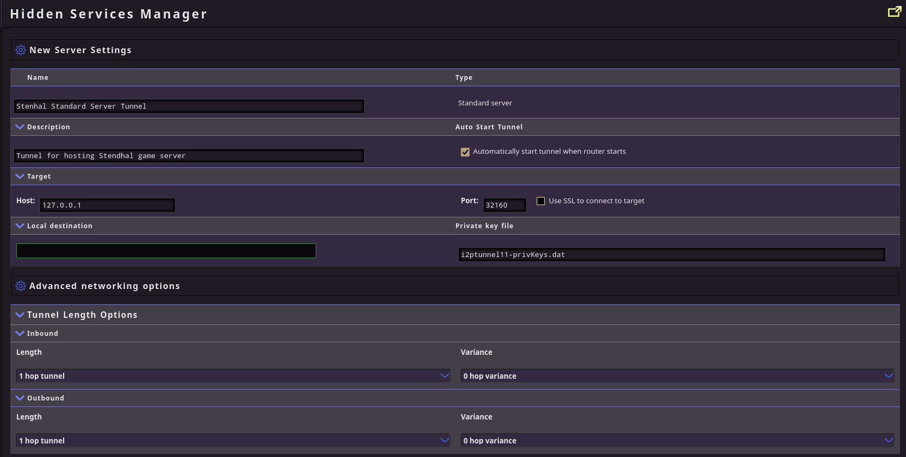

# How to Host a Stendhal Server on I2P

[Stendhal is a Free/Open Source Multiplayer Online Role Playing Game which is written in Java](https://stendhalgame.org/).
It has a freestanding Java server which you can self host, using [the instructions they publish on their wiki](https://stendhalgame.org/wiki/StendhalLocalhostServerOnLinux) if you want to do things the long way.


## Docker as the path of Least Resistance

Setting up the Stendhal server in a container is the obvious way to simply manage a Stendhal server for you and your friends.
I started with [this one by cosmin](https://codeberg.org/cosmin/stendhal-server-docker), but updated it to the latest version of Stendhal.
You can find the updated version in the `./stendhal-server-docker` subdirectory of this repository. To set it up, just build and run the container:

```sh
cd stendhal-server-docker
docker build -t stendhal-server:1.41.2 .
docker run --name=stendhal -p 127.0.0.1:32160:32160 --restart=always --volume stenhaldata:/stendhal/data stendhal-server:1.41.2
```

This with download and launch the 1.41.2 release of Stendhal Server and run it in, exposing the default Stendhal server port, `32160`.

## Setting up an I2P Standard Tunnel

Go to the [Hidden Services Manager at http://127.0.0.1:7657/i2ptunnel](http://127.0.0.1:7657/i2ptunnel).
At the bottom of the "I2P Hidden Services" section, create a new "Standard" tunnel using the "New Hidden Service" option.

- 

Since this is just a video game, it's more important that it performs relatively quickly than that it is resistant to attacks on it's anonymity.
Therefore, we'll only use one hop to set up the tunnel. Configure the tunnel with the options from the image below and click "Save" in the corner of the screen.

- 

And it's just that simple. You now have a working Stendhal server for I2P.

### Motivation

It's the Friday before Christmas and CCC has been cancelled, again.
It's probably the right thing for them to do, but what a bummer.
I would be very sad to find out that the first CCC I attended, "Resource Exhaustion," which occurred on the eve of the pandemic, was also the last in-person CCC.

In the past 2 years, CCC has also held a virtual conference via a piece of software called WorkAdventure.
WorkAdventure is a son of a gun to get working over I2P.
It depends on WebRTC and WebSockets, and it requires a separately-running Jitsi Meet instance which also depends on WebRTC and WebSockets.
There are also self-signed certificate issues to deal with before it will work, all of which have to be dealt with manually by users.
So even if I were able to get it to "Work"(I'm not, right now, with the skills I have`*`) the onboarding process would be offputting by design.

Nonetheless, I like the idea of a user having the ability to stand up a shared virtual world for themselves and their friends.
I'd also like to encourage them to think about what attributes that shared space might have.
Virtual spaces can be synchronous or asynchronous, they can have infinite resources or they can simulate scarcity.
Whether or not apparent proximity in the virtual world matters depends on the mechanics of the system.
In WorkAdventure, for instance, typewritten chats are room-wide, but voice/video chats only happen when users move their avatars close to eachother.
So every year around Christmas, I set one up and make it available over I2P.

 - [BrowserQuest(Shared Environment)](https://h53tzppm77qya2cugxsyl7pbct7kfeo344kbpscqod6iq4xiwtiq.b32.i2p:8000/game/client/index.html)
 - [Dungeon Crawl Stone Soup(Shared Scoreboard, Resources)](http://nhmfjkbvpabqhrop7pqyi2pors4iaydlmsyvyy6npgymgobllyaq.b32.i2p/)

#### `*`The skills I *don't* have

While I am aware of Javascript which doesn't run in the browser, every bit of Javascript I've ever written has run in a browser.
I'm also aware of Javascript trans-compilers and Javascript as a compile target, but I've never written any significant amount of TypeScript.
Someone who has done both of those things, who is not me, would probably find it relatively straightforward to adapt Workadventure and Jitsi Meet to use the SAMv3 API.
This would make it much easier to set up WorkAdventure over I2P, possibly easy enough to make self-hosting WorkAdventure accessible to all I2P users.

 - https://github.com/thecodingmachine/workadventure
 - https://codeberg.org/diva.exchange/i2p-sam
 - https://fosdem.org/2023/schedule/event/i2p_sam/
